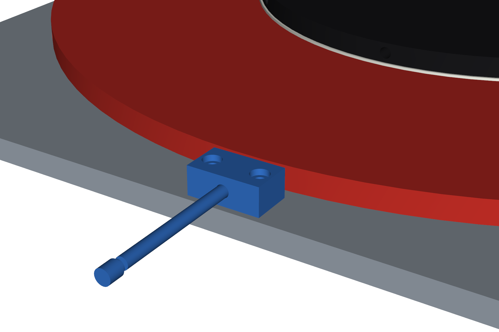

# Jig Assembly ragum

| File | Isi |
|---|---|
| `Ver3 Jig Assembly ragum tetap.step` | Versi asli: hanya piringan hitam yang berputar, ragum dibaut ke Base |
| `Ver4 Jig Assembly ragum putar.step` | Versi baru: ditambah **Piringan bawah** sehingga kedua ragum ikut berputar |
| `tools/tambah_piringan_bawah.py` | Script yang membuat Ver4 dari Ver3 (`pip install cadquery`, lalu `python3 tools/tambah_piringan_bawah.py`) |

## Perubahan Ver3 → Ver4

Susunan dari bawah ke atas (satuan mm):

1. **Base (rev)** – diperlebar ke sisi −X (tepi kiri X 130 → 20, masih di atas meja kerja; sudut R100 dan lubang Ø40 ke meja tetap) + 2× tap M8 untuk Blok pin index bawah.
2. **Ring UHMW** (asli) – tetap di kantong Base, sekarang jadi bantalan luncur piringan bawah.
3. **Piringan bawah** (baru) – Ø880 × 20, berputar pada Pin center, tinggi 2 mm di atas Base.
   - Lubang Ø50 di tengah untuk **Bushing perunggu bawah** (baru, Ø50/Ø40,1 × 20).
   - Kantong Ø465 dalam 10 di muka atas untuk **Ring UHMW atas** + 4 lubang sekrup ring.
   - 8× lubang tap M12 untuk baut kedua **Dudukan ragum** (pola sama dengan di Base).
   - 2× lubang tap M8 untuk **Blok pin index** (posisi sama dengan di Base).
   - Diameter 880 dipilih agar seluruh tapak dudukan ragum (sudut terjauh r ≈ 437 dari sumbu) tertopang.
4. **Ring UHMW atas** (baru, salinan ring asli).
5. **Piringan (baru)** (piringan utama), bushing, Pin index + knob, kedua ragum beserta stud, mur, vise holder, clamp, rod dan handle – **semuanya naik 22 mm**, posisi XZ tidak berubah.

**Kunci samping piringan bawah** (sisi −X): **Blok pin index bawah** (34 × 24 × 60, dibaut 2× M8 ke Base) dan **Pin index bawah** + **Knob pin index bawah** (salinan Pin index asli) yang masuk horizontal 15 mm ke salah satu dari 8 lubang radial Ø10,5 di tepi piringan bawah (tiap 45°). Tarik pin ≥ 15 mm untuk memutar ragum.

**Pin center** diganti **Pin center (panjang)**: flens tetap dibaut ke Base, poros Ø40 diperpanjang 22 mm (ujung atas Y 305,3 → 327,3) agar menembus bushing kedua piringan.

Hasil pengecekan: celah pin–bushing 0,05 mm di kedua piringan, tidak ada tumpang tindih antar part baru/berpindah.

## Catatan desain

- Piringan bawah Ø880 lebih lebar dari Base (750 × 810): menjorok ±65 mm di sisi X dan ±35 mm di sisi Z. Jangkauan putar ragum sendiri memang sudah ~r 437, jadi ini tidak bisa dihindari kalau ragum harus berputar penuh.
- Piringan bawah hanya ditopang Ring UHMW Ø464; bagian luar tempat ragum menggantung (cantilever). Kalau perlu lebih kaku, pertimbangkan ring UHMW/bantalan kedua berdiameter lebih besar di Base.
- Pin index piringan utama tetap seperti Ver3 (ikut naik 22 mm). Bloknya tidak ada di STEP Ver3 (disembunyikan di Fusion saat export); tempatnya sudah disiapkan di piringan bawah (2× tap M8).
- Pin index bawah + knob menjorok ±117 mm keluar dari tepi meja kerja di sisi −X.
- Berat piringan bawah baja Ø880 × 20 ≈ 95 kg.
