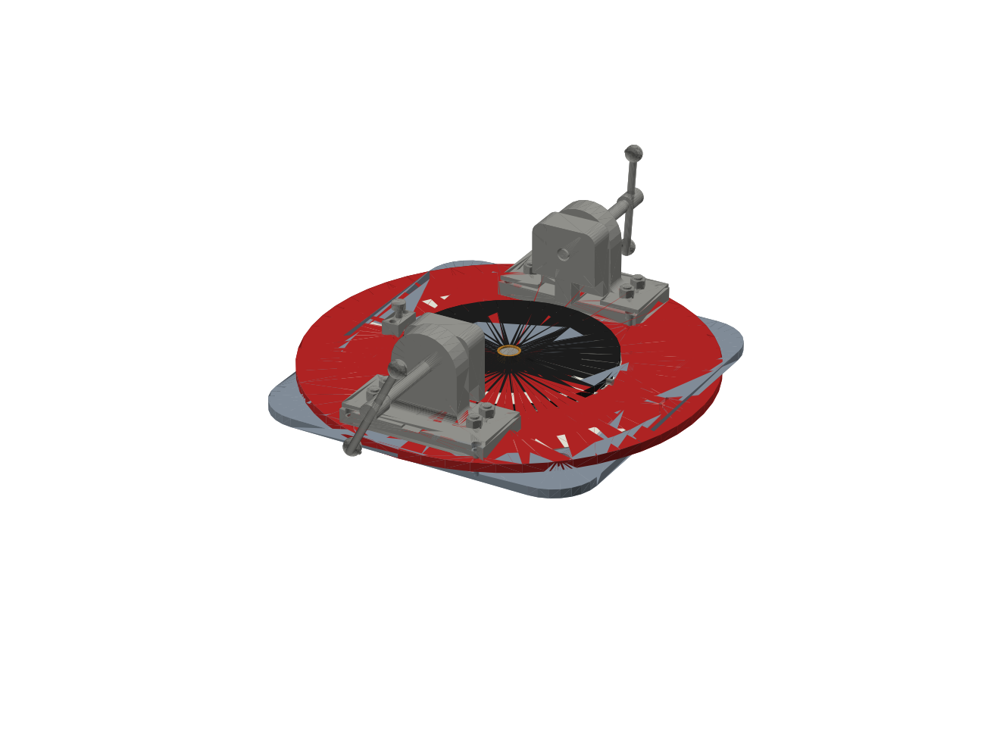
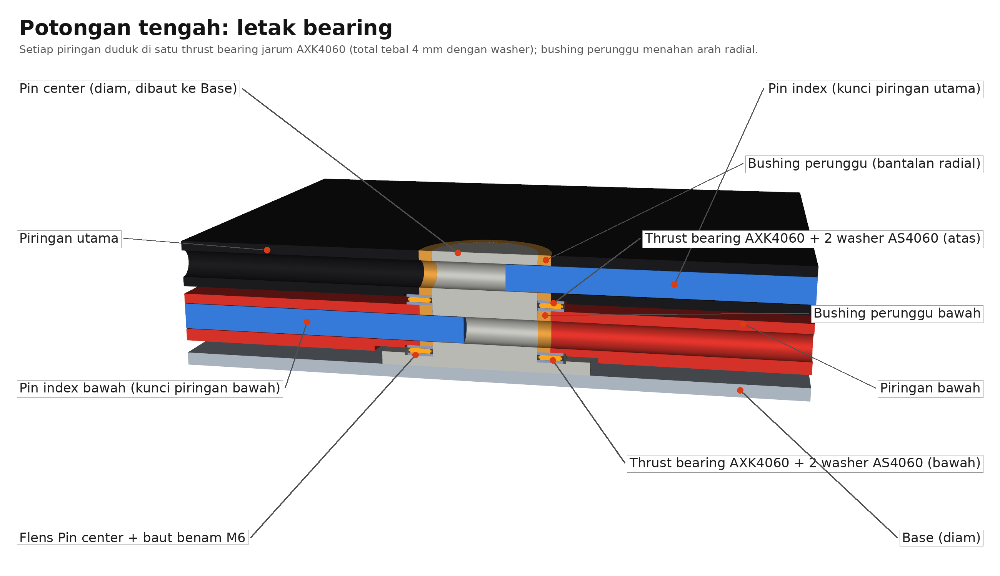
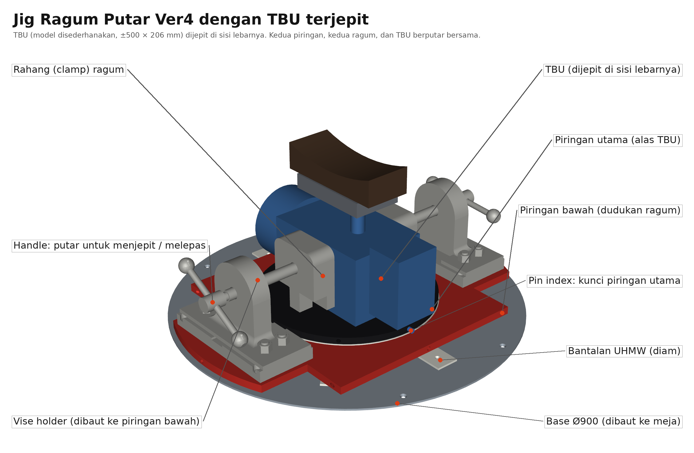
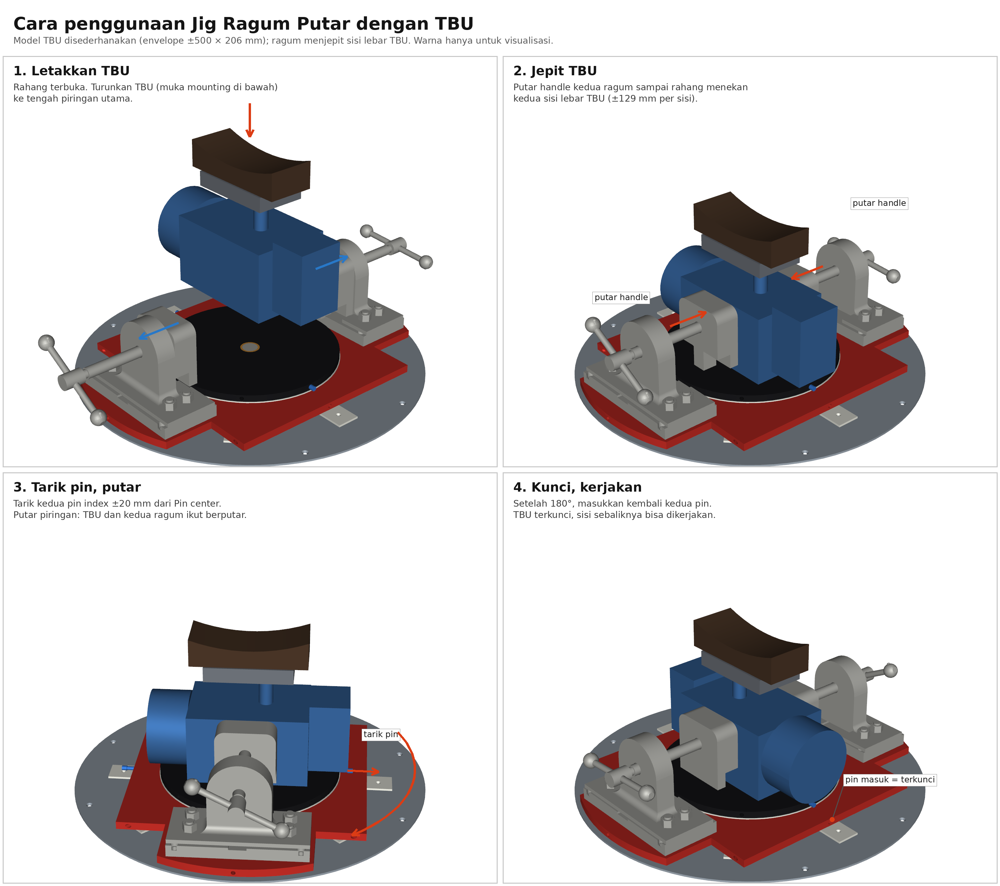

# Jig Assembly ragum

| File | Isi |
|---|---|
| `Ver3 Jig Assembly ragum tetap.step` | Versi asli: hanya piringan hitam yang berputar, ragum dibaut ke Base |
| `Ver4 Jig Assembly ragum putar.step` | Versi baru: ditambah **Piringan bawah** sehingga kedua ragum ikut berputar |
| `Ver4 Jig + TBU terjepit.step` | Ver4 dengan TBU (model sederhana) dalam kondisi terjepit kedua ragum |
| `tools/tambah_piringan_bawah.py` | Script yang membuat Ver4 dari Ver3 (`pip install cadquery`, lalu `python3 tools/tambah_piringan_bawah.py`) |

## Perubahan Ver3 → Ver4

Bagian baru dirampingkan ke faktor keamanan ≥ 2 (spesifikasi kelompok). Susunan dari bawah ke atas (satuan mm):

1. **Base (rev)** – plat bulat SS400 Ø900 × 5 yang menutup seluruh area putar, ditopang penuh oleh meja kerja dan diikat dengan **8 baut kepala benam M8** (rata permukaan, mur di bawah meja). Ada 4 tap M6 untuk ring UHMW, 4 tap M6 untuk flens Pin center, dan 8 tap M6 untuk bantalan UHMW.
2. **Ring UHMW** – Ø464 / Ø300 × 5, di atas Base, 4 baut L M6 kepala tenggelam.
   **8 Bantalan UHMW** – 70 × 60 × 5 di r ≈ 330 (tiap 45°), di bawah ujung piringan bawah tempat ragum, jadi ragum tidak mengambang. Setiap bantalan diikat 1 baut benam M6.
3. **Piringan bawah** (baru) – plat SS400 20 mm, lingkaran Ø880 dipangkas menjadi lajur 600 mm sepanjang sumbu ragum; di bawah dudukan (lebih dari 270 mm dari sumbu) lebarnya 360 mm (±65 kg).
   - Lubang Ø50 di tengah untuk **Bushing perunggu bawah** (Ø50/Ø40,1 × 15), cekungan bawah Ø86 × 2 di atas flens Pin center, dan cekungan Ø62 × 3 untuk thrust bearing bawah.
   - Cekungan Ø465 × 1 di muka atas untuk **Ring UHMW atas** (Ø464 / Ø300 × 3).
   - 8× tap M12 untuk baut kedua **Dudukan ragum** (pola sama dengan Base Ver3).
   - 8× lubang radial Ø10,5 (tiap 45°) dari tepi sampai lubang tengah, untuk Pin index bawah.
4. **Piringan (baru)** (piringan utama), bushing, Pin index + knob, kedua ragum beserta stud, mur, vise holder, clamp, rod dan handle – **naik 10 mm** terhadap Ver3, posisi XZ tidak berubah. Jarak rahang ragum ke piringan utama sama seperti Ver3. Piringan utama diberi cekungan Ø62 × 1 di muka bawah untuk thrust bearing atas, dan bushing-nya dipendekkan 1 mm (Ø50/Ø40,1 × 17).
5. Alas TBU (muka atas piringan utama) berada **50 mm** di atas meja kerja, sesuai REQ-02 (≤ 50 mm).

### Bearing

Setiap piringan berputar di atas satu **thrust bearing jarum AXK4060** (d40 × D60 × 2) yang diapit 2 **washer AS4060** (1 mm), jadi tebal satu set 4 mm. **Bushing perunggu** menahan arah radial.
- **Set bawah**: dibenamkan 1 mm di flens Pin center (diam) dan menopang piringan bawah. Baut flens diganti baut benam M6 supaya rata di bawah washer.
- **Set atas**: di cekungan atas piringan bawah dan menopang piringan utama.

Bearing bola 51108 (tinggi 13 mm) dan 6008 (lebar 15 mm) tidak dipakai: keduanya hanya muat kalau jig dinaikkan atau pin pengunci, yang lewat di tengah tebal plat, dipindahkan. Ring dan bantalan UHMW tetap menopang bagian luar piringan.

### Kunci samping (kedua piringan)

Pin masuk dari tepi piringan, lurus ke tengah, dan ujungnya masuk ±12 mm ke lubang silang di **Pin center** yang diam. Tarik pin ±20 mm agar piringan bisa diputar; kunci di 0° dan 180° (lihat catatan posisi kunci di bawah).

- **Piringan utama**: **Pin index (panjang)** = Pin index asli yang diperpanjang ke dalam; knob tetap di tempatnya.
- **Piringan bawah**: **Pin index bawah** (batang Ø10) + **Knob pin index bawah** (salinan knob asli) di sisi −X.
- **Pin center (panjang)**: flens dibaut ke Base; poros Ø40 sampai rata muka atas piringan utama, 2 lubang silang Ø10,5.

### Faktor keamanan (target ≥ 2)

| Bagian | Beban penentu | n |
|---|---|---|
| Piringan bawah, potongan tengah (melewati lubang pin, Ø50, dan cekungan bearing) | Momen jepit ragum Fc·h = 10 829 N × 210 mm (momen penuh, konservatif) | 2,6 |
| Piringan bawah, awal bagian 360 mm (z = 275) | Momen jepit penuh (konservatif) | 2,5 |
| Piringan bawah, potongan lain | Sama | > 3,2 |
| Ulir M12 dudukan di piringan bawah (plat 20, ulir terpakai 18) | Tarik baut dari momen guling + preload | 3,9 |
| Baut M12 dudukan | Sama; momen kencang dibatasi 37 N·m | ±3 |
| Baut flens Pin center M6 (geser) | Torsi kerja 210 N·m saat terkunci | 3,4 |
| Base 5 mm, ring dan bantalan UHMW 5/3 mm, bushing 15/17 mm | Berat; ditopang meja | > 4 |
| Thrust bearing AXK4060 | Berat piringan + TBU (< 1,5 kN per bearing) | jauh di atas kebutuhan |

Berat total jig (tanpa TBU dan meja): ±188 kg.

Hasil pengecekan CAD: celah pin–lubang 0,25 mm, pin center–bushing 0,05 mm, flens Pin center–piringan bawah 2 mm, pin–washer bearing ≥ 2 mm, knob pin bawah–bantalan 3,6 mm; tidak ada tumpang tindih antar part.

## Catatan

- Base Ø900 menjorok ±41 mm keluar dari tepi meja kerja di sisi +Z.
- Baut Base ke meja diubah dari 4 × M20 (REQ-05) menjadi 8 × M8 kepala benam, karena kepala M20 akan tertabrak piringan bawah.
- Dudukan ragum, vise holder, dan clamp adalah part Ver3 dan tidak diubah. Piringan utama (18 mm) hanya ditambah cekungan bearing Ø62 × 1.

## Cara penggunaan (visualisasi dengan TBU)

1. Buka kedua rahang. Letakkan TBU dengan muka mounting (4 × M20) di bawah, di tengah piringan utama, dengan sisi panjangnya melintang terhadap sumbu ragum.
2. Putar handle kedua ragum sampai rahang menekan kedua sisi lebar TBU. Untuk lebar ±206 mm, setiap rahang maju ±129 mm. T-handle perlu diposisikan mendatar di akhir langkah; kalau menghadap ke bawah, ia menabrak dudukan ragum (bebas sampai langkah ±115 mm).
3. Tarik kedua pin index ±20 mm dari Pin center, lalu putar piringan. TBU, kedua ragum, dan kedua piringan berputar bersama.
4. Setelah 180°, masukkan kembali kedua pin. TBU terkunci dan sisi sebaliknya bisa dikerjakan.

Model TBU disederhanakan (envelope ±500 × 206 mm, pola mounting 114 × 250 dari gambar Nabtesco 152-3.5), bukan geometri asli. Kedua ragum di Ver3 terpasang miring ±0,82° terhadap sumbu jig, jadi TBU di model diputar dengan sudut yang sama. Dibuat dengan `tools/visualisasi_tbu.py` (STEP) dan `tools/render_visualisasi_tbu.py` (gambar).

**Catatan posisi kunci:** saat ini kedua pin hanya bisa mengunci di 0° dan 180°.
- Pin index bawah (panjang 292 mm) hanya cocok di arah lajur ±X. Di sudut lain, tepi piringan bawah lebih jauh dari pusat (424–440 mm), sehingga pin dan knob tertanam di plat.
- Piringan utama Ver3 tidak punya lubang radial tembus di salah satu arah 90°.
